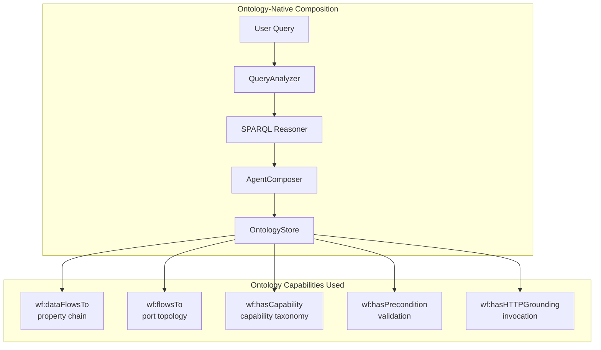

# Agent Composition Ontology Enhancement Plan

## Overview

This plan leverages the **existing waterFRAME ontology modules** to enable semantic agent composition. Instead of creating new hardcoded services, we will use the ontology's native capabilities:

- [`wf:dataFlowsTo`](data/ontology_enhanced/modules/agents.ttl:195) - Property chain for automatic composition inference
- [`wf:requiresInput`](data/ontology_enhanced/modules/agents.ttl:143)/[`wf:producesOutput`](data/ontology_enhanced/modules/agents.ttl:149) - Operation I/O specification
- [`wf:flowsTo`](data/ontology_enhanced/modules/core/properties.ttl:46) - Port-based flow topology
- [`wf:hasCapability`](data/ontology_enhanced/modules/capabilities.ttl:151) - Capability-based agent discovery
- [`wf:hasPrecondition`](data/ontology_enhanced/modules/agents.ttl:164)/[`wf:hasPostcondition`](data/ontology_enhanced/modules/agents.ttl:170) - Execution validation
- [`wf:HTTPGrounding`](data/ontology_enhanced/modules/agents.ttl:76) - Operation invocation

---

## Current Problem

The [`AgentComposer`](case_studies/core/orchestrator/src/ontEAUlogy_core/services/agent_composer.py:97) uses string-matching:

```python
# Current: exact name matching only
def can_execute_with(self, available_data: Set[str]) -> bool:
    return self.required_inputs.issubset(available_data)
```

This fails for MBR→RO chain because `effluent_cod_mg_l` ≠ `feed_cod_mg_l`.

---

## Solution: Use Ontology's Native Composition Capabilities

### 1. Property Chain Inference (Already Defined in Ontology)

The ontology already defines [`wf:dataFlowsTo`](data/ontology_enhanced/modules/agents.ttl:195) with a property chain axiom:

```turtle
wf:dataFlowsTo a owl:ObjectProperty ;
    rdfs:comment "Indicates that output from this operation can serve as input to the target operation." ;
    owl:propertyChainAxiom (
        wf:producesOutput
        [ owl:inverseOf wf:requiresInput ]
    ) .
```

**This means**: If Operation A produces output X, and Operation B requires input X, then A `dataFlowsTo` B is **automatically inferred** by the reasoner.

### 2. SPARQL-Based Composition Discovery

Instead of building a custom `ParameterCompatibilityGraph`, use SPARQL with the ontology's property chains:

```sparql
PREFIX wf: <https://ugentbiomath.github.io/waterframe#>

# Discover composable operations using dataFlowsTo
SELECT ?sourceOp ?targetOp ?sharedParam
WHERE {
  ?sourceOp a wf:Operation ;
            wf:producesOutput ?sharedParam .
  
  ?targetOp a wf:Operation ;
            wf:requiresInput ?sharedParam .
  
  # dataFlowsTo is inferred via property chain
  ?sourceOp wf:dataFlowsTo ?targetOp .
}
```

### 3. Port-Based Flow Discovery (Physical Connections)

Use the port topology from [`properties.ttl`](data/ontology_enhanced/modules/core/properties.ttl):

```sparql
PREFIX wf: <https://ugentbiomath.github.io/waterframe#>

# Trace flow through physical ports
SELECT ?sourceEntity ?targetEntity ?flowPath
WHERE {
  # Agent monitors an output port
  ?sourceAgent wf:monitorsPort ?sourcePort .
  ?sourcePort a wf:OutputPort ;
              wf:flowsTo+ ?targetPort .  # Transitive closure
  
  # Target agent monitors the connected input port
  ?targetAgent wf:monitorsPort ?targetPort .
  ?targetPort a wf:InputPort .
  
  # Get the entities these ports belong to
  ?sourcePort wf:belongsTo ?sourceEntity .
  ?targetPort wf:belongsTo ?targetEntity .
}
```

### 4. Capability-Based Agent Discovery

Use the capability taxonomy from [`capabilities.ttl`](data/ontology_enhanced/modules/capabilities.ttl):

```sparql
PREFIX wf: <https://ugentbiomath.github.io/waterframe#>
PREFIX cap: <https://ugentbiomath.github.io/waterframe/capability#>

# Find agents by capability
SELECT ?agent ?operation
WHERE {
  ?agent a wf:ComputationalAgent ;
         wf:hasCapability cap:DynamicSimulation ;
         wf:hasCapability cap:WaterQualityPrediction ;
         wf:offersOperation ?operation .
  
  ?operation wf:requiresInput ?input .
  FILTER(?input = wf:InfluentCOD_Input)
}
```

### 5. Precondition/Postcondition Validation

Use [`wf:Precondition`](data/ontology_enhanced/modules/agents.ttl:62) and [`wf:Postcondition`](data/ontology_enhanced/modules/agents.ttl:69):

```sparql
PREFIX wf: <https://ugentbiomath.github.io/waterframe#>

# Get preconditions for execution validation
SELECT ?operation ?constraint ?expression
WHERE {
  ?operation a wf:Operation ;
             wf:hasPrecondition ?precond .
  
  ?precond wf:constrainsParameter ?constraint ;
           wf:constraintExpression ?expression .
}
```

---

## Revised Architecture



---

## Implementation Using Ontology Patterns

### Phase 1: SPARQL-Based Composition

**Replace** `ParameterCompatibilityGraph` with SPARQL queries using ontology property chains:

```python
class OntologyComposer:
    """
    Agent composer using waterFRAME ontology property chains.
    
    Uses:
    - wf:dataFlowsTo (inferred via property chain)
    - wf:requiresInput/wf:producesOutput
    - wf:flowsTo for port-based discovery
    """
    
    async def compose(
        self,
        initial_data: Set[str],
        target_outputs: Set[str]
    ) -> CompositionResult:
        """
        Compose agents using ontology relationships.
        
        Leverages the wf:dataFlowsTo property chain which is inferred when:
        - Operation A producesOutput X
        - Operation B requiresInput X
        """
        # Query 1: Find operations that can consume initial_data
        query = """
        PREFIX wf: <https://ugentbiomath.github.io/waterframe#>
        
        SELECT DISTINCT ?agent ?operation ?input ?output
        WHERE {
          ?agent a wf:ComputationalAgent ;
                 wf:offersOperation ?operation .
          
          ?operation wf:requiresInput ?input ;
                     wf:producesOutput ?output .
          
          FILTER(?input IN (""" + ', '.join(f'"{d}"' for d in initial_data) + """))
        }
        """
        
        # Query 2: Find composition chains via dataFlowsTo
        chain_query = """
        PREFIX wf: <https://ugentbiomath.github.io/waterframe#>
        
        SELECT ?sourceOp ?targetOp ?sharedOutput
        WHERE {
          ?sourceOp wf:producesOutput ?sharedOutput .
          ?targetOp wf:requiresInput ?sharedOutput .
          
          # dataFlowsTo is inferred by reasoner via property chain
          ?sourceOp wf:dataFlowsTo ?targetOp .
        }
        """
        
        # Execute SPARQL against ontology store
        results = await self._ontology_store.query(chain_query)
        
        # Build composition from inferred relationships
        return self._build_composition(results, initial_data, target_outputs)
```

### Phase 2: Capability-Based Discovery

Use the existing capability taxonomy instead of string matching:

```python
async def discover_by_capability(
    self,
    required_capabilities: List[str],
    available_data: Set[str]
) -> List[ComputationalAgent]:
    """
    Discover agents by capability using cap:* taxonomy.
    
    Capabilities from capabilities.ttl:
    - cap:DynamicSimulation
    - cap:WaterQualityPrediction
    - cap:MassBalance
    - cap:Optimization
    """
    query = """
    PREFIX wf: <https://ugentbiomath.github.io/waterframe#>
    PREFIX cap: <https://ugentbiomath.github.io/waterframe/capability#>
    
    SELECT DISTINCT ?agent
    WHERE {
      ?agent a wf:ComputationalAgent ;
             wf:hasCapability ?cap ;
             wf:offersOperation ?op .
      
      ?op wf:requiresInput ?input .
      
      FILTER(?cap IN (""" + ', '.join(required_capabilities) + """))
      FILTER(?input IN (""" + ', '.join(f'"{d}"' for d in available_data) + """))
    }
    """
    
    return await self._ontology_store.query(query)
```

### Phase 3: Port-Based Flow Composition

Use [`wf:flowsTo`](data/ontology_enhanced/modules/core/properties.ttl:46) and [`wf:hasDownstreamComponent`](data/ontology_enhanced/modules/core/properties.ttl:66):

```python
async def compose_via_physical_flows(
    self,
    source_entity: str
) -> List[CompositionChain]:
    """
    Discover composition chains via physical flow connections.
    
    Uses port topology:
    - wf:OutputPort flowsTo wf:InputPort
    - Component hasDownstreamComponent Component
    """
    query = """
    PREFIX wf: <https://ugentbiomath.github.io/waterframe#>
    
    SELECT ?sourceAgent ?targetAgent ?flowPath
    WHERE {
      # Source agent monitors output port
      ?sourceAgent wf:monitorsPort ?outPort .
      ?outPort a wf:OutputPort ;
               wf:flowsTo+ ?inPort .  # Transitive: follows flow path
      
      # Target agent monitors connected input port
      ?targetAgent wf:monitorsPort ?inPort .
      ?inPort a wf:InputPort .
    }
    ORDER BY ?flowPath
    """
    
    return await self._ontology_store.query(query)
```

### Phase 4: Execution with Precondition Validation

Use [`wf:Precondition`](data/ontology_enhanced/modules/agents.ttl:62) for runtime validation:

```python
async def validate_execution(
    self,
    operation: str,
    input_data: Dict[str, Any]
) -> ValidationResult:
    """
    Validate operation execution against preconditions.
    
    Uses wf:hasPrecondition, wf:constraintExpression from agents.ttl
    """
    query = """
    PREFIX wf: <https://ugentbiomath.github.io/waterframe#>
    
    SELECT ?constraint ?expression
    WHERE {
      <%s> wf:hasPrecondition ?precond .
      ?precond wf:constrainsParameter ?constraint ;
               wf:constraintExpression ?expression .
    }
    """ % operation
    
    preconditions = await self._ontology_store.query(query)
    
    # Evaluate each constraint expression
    violations = []
    for precond in preconditions:
        param = precond['constraint']
        expr = precond['expression']  # e.g., "flow_rate > 0"
        
        if param in input_data:
            if not self._evaluate_constraint(expr, input_data[param]):
                violations.append(f"{param}: {expr}")
    
    return ValidationResult(valid=len(violations) == 0, violations=violations)
```

### Phase 5: HTTP Invocation via Grounding

Use [`wf:HTTPGrounding`](data/ontology_enhanced/modules/agents.ttl:76):

```python
async def invoke_operation(
    self,
    operation: str,
    input_data: Dict[str, Any]
) -> InvocationResult:
    """
    Invoke operation using HTTP grounding from ontology.
    
    Uses wf:hasHTTPGrounding, wf:httpMethod, wf:operationPath
    """
    query = """
    PREFIX wf: <https://ugentbiomath.github.io/waterframe#>
    
    SELECT ?method ?path ?requestFormat ?responseFormat
    WHERE {
      <%s> wf:hasHTTPGrounding ?grounding .
      ?grounding wf:httpMethod ?method ;
                 wf:operationPath ?path ;
                 wf:requestFormat ?requestFormat ;
                 wf:responseFormat ?responseFormat .
    }
    """ % operation
    
    grounding = await self._ontology_store.query(query)
    
    if not grounding:
        raise NoGroundingError(f"No HTTP grounding for {operation}")
    
    g = grounding[0]
    
    # Invoke via HTTP
    async with httpx.AsyncClient() as client:
        response = await client.post(
            f"{self._base_url}{g['path']}",
            json=input_data,
            headers={"Content-Type": g['requestFormat']}
        )
        return InvocationResult(
            success=response.status_code == 200,
            data=response.json() if g['responseFormat'] == 'application/json' else response.text
        )
```

---

## Agent Declaration Pattern (TTL)

Agents should be declared using the existing ontology patterns:

```turtle
@prefix wf: <https://ugentbiomath.github.io/waterframe#> .
@prefix cap: <https://ugentbiomath.github.io/waterframe/capability#> .

# The agent
case:MBR_Agent a wf:SimulationAgent ;
    rdfs:label "MBR Simulation Agent" ;
    wf:implements case:MBR_Model ;
    wf:simulates case:Household_MBR_Unit ;
    wf:runsOn case:MBR_Software ;
    wf:hasCapability cap:DynamicSimulation, 
                     cap:MassBalance, 
                     cap:WaterQualityPrediction ;
    wf:offersOperation case:MBR_SimulateOp .

# The operation
case:MBR_SimulateOp a wf:Operation ;
    rdfs:label "Simulate MBR" ;
    wf:requiresInput case:MBR_Influent_Flow, 
                     case:MBR_Influent_COD ;
    wf:producesOutput case:MBR_Effluent_Flow, 
                      case:MBR_Effluent_COD ;
    wf:hasPrecondition [
        a wf:Precondition ;
        wf:constrainsParameter case:MBR_Influent_Flow ;
        wf:constraintExpression "influent_flow > 0"
    ] ;
    wf:hasPostcondition [
        a wf:Postcondition ;
        wf:constraintExpression "mass_balance_satisfied(COD)"
    ] ;
    wf:hasHTTPGrounding [
        a wf:HTTPGrounding ;
        wf:httpMethod "POST" ;
        wf:operationPath "/simulate/mbr" ;
        wf:requestFormat "application/json" ;
        wf:responseFormat "application/json" ;
        wf:requiresAuthentication false
    ] ;
    wf:estimatedExecutionTime 2.5 ;
    wf:computationalComplexity "O(n*m)" .

# Parameters (reuse ModelInput/ModelOutput from information.ttl)
case:MBR_Influent_Flow a wf:ModelInput ;
    wf:parameterName "influent_flow_m3d" ;
    wf:hasUnit "m3/d" ;
    wf:minValue 0.0 ;
    wf:maxValue 1000.0 .

case:MBR_Effluent_Flow a wf:ModelOutput ;
    wf:parameterName "effluent_flow_m3d" ;
    wf:hasUnit "m3/d" .
```

---

## Testing Strategy

### Test 1: Property Chain Inference

```python
async def test_dataflows_to_inference():
    """Verify wf:dataFlowsTo is inferred via property chain."""
    query = """
    PREFIX wf: <https://ugentbiomath.github.io/waterframe#>
    
    ASK {
      case:MBR_SimulateOp wf:dataFlowsTo case:RO_SimulateOp .
    }
    """
    
    # This should return true if MBR producesOutput X and RO requiresInput X
    result = await ontology_store.query(query)
    assert result is True
```

### Test 2: Port Flow Discovery

```python
async def test_port_flow_composition():
    """Discover composition via wf:flowsTo."""
    composer = OntologyComposer(ontology_store)
    
    # WWTP1 effluent flows to River, becomes DWP2 intake
    chains = await composer.compose_via_physical_flows("case:WWTP1")
    
    assert any(c.target_agent == "case:DWP2_Agent" for c in chains)
```

### Test 3: Capability-Based Discovery

```python
async def test_capability_discovery():
    """Find agents by cap:* capabilities."""
    agents = await composer.discover_by_capability(
        required_capabilities=["cap:DynamicSimulation", "cap:MassBalance"],
        available_data={"influent_cod_mg_l"}
    )
    
    assert any(a.id == "case:MBR_Agent" for a in agents)
```

### Test 4: Precondition Validation

```python
async def test_precondition_validation():
    """Validate execution using wf:hasPrecondition."""
    result = await composer.validate_execution(
        operation="case:MBR_SimulateOp",
        input_data={"influent_flow_m3d": -5}  # Invalid: should be > 0
    )
    
    assert result.valid is False
    assert "influent_flow_m3d: influent_flow > 0" in result.violations
```

### Test 5: HTTP Invocation

```python
async def test_http_grounding_invocation():
    """Invoke operation using wf:hasHTTPGrounding."""
    result = await composer.invoke_operation(
        operation="case:MBR_SimulateOp",
        input_data={"influent_flow_m3d": 100, "influent_cod_mg_l": 200}
    )
    
    assert result.success is True
```

---

## Files to Modify

### 1. `services/agent_composer.py`

**Replace** custom compatibility logic with SPARQL using ontology patterns:

```python
# BEFORE: Hardcoded string matching
def can_execute_with(self, available_data: Set[str]) -> bool:
    return self.required_inputs.issubset(available_data)

# AFTER: Ontology-based discovery using wf:dataFlowsTo
async def discover_composable_operations(
    self, 
    available_data: Set[str]
) -> List[Operation]:
    query = """
    PREFIX wf: <https://ugentbiomath.github.io/waterframe#>
    
    SELECT ?op ?input ?output
    WHERE {
      ?op a wf:Operation ;
          wf:requiresInput ?input ;
          wf:producesOutput ?output .
      FILTER(?input IN (...))
    }
    """
    return await self._ontology.query(query)
```

### 2. `data/agent_declarations.ttl`

**Update** to use waterFRAME ontology patterns:

```turtle
# Use wf:Operation, wf:requiresInput, wf:hasHTTPGrounding
# NOT custom predicates
```

### 3. `schemas/models.py`

**Extend** to capture ontology relationships:

```python
class CompositionLayer(BaseModel):
    layer_index: int
    operations: List[str]  # wf:Operation IRIs
    # Parameter mappings inferred from wf:dataFlowsTo
    inferred_mappings: Dict[str, str]  # output -> input
```

---

## Success Criteria

1. **Ontology Property Chains Used**: Composition uses `wf:dataFlowsTo` inference
2. **Capability Taxonomy Leveraged**: Discovery uses `cap:*` classes
3. **Port Topology Utilized**: Flow paths use `wf:flowsTo`
4. **Preconditions Validated**: Runtime checks use `wf:hasPrecondition`
5. **HTTP Grounding**: Invocation uses `wf:hasHTTPGrounding`
6. **No Hardcoded Rules**: All relationships come from ontology
7. **Test Coverage**: >90% for SPARQL-based composition

---

## Key Ontology References

| Feature | Ontology Module | Key Classes/Properties |
|---------|-----------------|------------------------|
| Operation I/O | [`agents.ttl`](data/ontology_enhanced/modules/agents.ttl) | `wf:Operation`, `wf:requiresInput`, `wf:producesOutput` |
| Composition Chain | [`agents.ttl`](data/ontology_enhanced/modules/agents.ttl) | `wf:dataFlowsTo` (property chain) |
| Port Topology | [`properties.ttl`](data/ontology_enhanced/modules/core/properties.ttl) | `wf:flowsTo`, `wf:OutputPort`, `wf:InputPort` |
| Capabilities | [`capabilities.ttl`](data/ontology_enhanced/modules/capabilities.ttl) | `wf:hasCapability`, `cap:*` taxonomy |
| Validation | [`agents.ttl`](data/ontology_enhanced/modules/agents.ttl) | `wf:Precondition`, `wf:constraintExpression` |
| Invocation | [`agents.ttl`](data/ontology_enhanced/modules/agents.ttl) | `wf:HTTPGrounding`, `wf:httpMethod` |
| Model I/O | [`information.ttl`](data/ontology_enhanced/modules/information.ttl) | `wf:ModelInput`, `wf:ModelOutput` |
